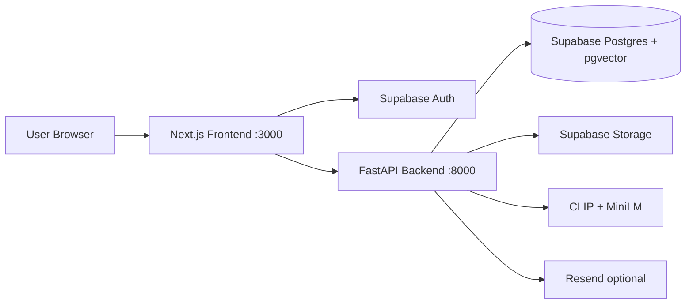

# LostLink

**AI-powered lost & found for college festivals**

**Repository:** https://github.com/Aru-150905/LOSTLINK-

LostLink helps festival-goers reunite with lost belongings. Users report lost or found items with photos and details; the app uses CLIP image embeddings, text embeddings, and metadata scoring to find likely matches. Claims go through admin review before pickup.

> **No API keys required for local setup.** The included setup script starts a local Supabase instance and writes all config files automatically.

---

## For evaluators (quick start)

If you're grading or reviewing this project, you only need to:

1. **Clone the repo**
   ```bash
   git clone https://github.com/Aru-150905/LOSTLINK-.git
   cd LOSTLINK-
   ```
2. **Install prerequisites** — Docker Desktop (running), [Supabase CLI](https://supabase.com/docs/guides/local-development/cli/getting-started), Python 3.11+, Node.js 20+
3. **Run the one-shot setup script**
   ```bash
   bash scripts/setup_local.sh          # macOS / Linux
   # or: powershell -ExecutionPolicy Bypass -File scripts\setup_local.ps1   # Windows
   ```
4. **Start backend** (Terminal 1) and **frontend** (Terminal 2) — commands are printed at the end of the setup script
5. **Open** http://localhost:3000

See [LOCAL_SETUP.md](./LOCAL_SETUP.md) for step-by-step details, a demo walkthrough, admin setup, and troubleshooting.

**Expect on first run:** Docker image pulls, `pip install` (PyTorch is large), and a one-time ~500 MB AI model download. The first item upload may take 30–60 seconds while models load.

---

## Features

- **Report items** — Upload lost or found items with title, description, location, time, and optional photo
- **AI matching** — Combines image similarity (70%), text similarity (20%), and metadata (10%) to rank candidates
- **Match review** — Browse stored matches or re-run a search from your item page
- **Secure claims** — Submit a claim; admins approve or reject before handoff
- **Notifications** — In-app alerts for matches, claims, and status updates
- **Admin dashboard** — Review pending claims, view stats, and manage the festival lost & found desk
- **Email alerts** *(optional)* — Match and claim notifications via [Resend](https://resend.com) (falls back to console logging when not configured)

---

## Tech Stack

| Layer | Technologies |
|-------|--------------|
| **Frontend** | Next.js 16, React 19, TypeScript, Tailwind CSS, shadcn/ui, Supabase Auth |
| **Backend** | FastAPI, Python 3.11+, PyTorch, Hugging Face Transformers, Sentence Transformers |
| **Database** | Supabase (PostgreSQL + pgvector), Row Level Security |
| **Storage** | Supabase Storage (`item-images` bucket) |
| **AI models** | `openai/clip-vit-base-patch32` (512-dim image), `all-MiniLM-L6-v2` (384-dim text) |

---

## Architecture



---

## Prerequisites

Install these once before running the app locally:

- [Docker Desktop](https://www.docker.com/products/docker-desktop/) (running)
- [Supabase CLI](https://supabase.com/docs/guides/local-development/cli/getting-started)
- **Python 3.11+**
- **Node.js 20+**

> **Note:** The first backend request that runs AI matching downloads ~500 MB of model weights from Hugging Face. Set `WARMUP_MODELS=true` in `backend/.env` to preload models at startup instead.

---

## Quick Start (Recommended)

The setup script starts local Supabase, applies migrations, and writes both env files automatically. **No external API keys are required for local development.**

### macOS / Linux

```bash
bash scripts/setup_local.sh
```

### Windows (PowerShell)

```powershell
powershell -ExecutionPolicy Bypass -File scripts\setup_local.ps1
```

Then start the backend and frontend in **two separate terminals**:

```bash
# Terminal 1 — Backend
cd backend && python -m venv venv && source venv/bin/activate
pip install -r requirements.txt
cd ..
uvicorn backend.app.main:app --reload --port 8000
```

```bash
# Terminal 2 — Frontend
cd frontend
npm install
npm run dev
```

Open the app:

- **App:** http://localhost:3000
- **API health:** http://localhost:8000/health
- **Supabase Studio:** http://127.0.0.1:54323 (view DB, auth users, storage)

---

## Environment Variables

The setup script writes these for you. Use the tables below if you are configuring manually or deploying to production.

### Backend (`backend/.env`)

Copy from `backend/.env.example`:

| Variable | Required | Description |
|----------|----------|-------------|
| `SUPABASE_URL` | Yes | Supabase project API URL |
| `SUPABASE_SERVICE_ROLE_KEY` | Yes | Service role key (server-side only — keep secret) |
| `SUPABASE_JWT_SECRET` | Yes | JWT secret for verifying auth tokens |
| `CORS_ORIGINS` | Yes | Comma-separated allowed origins (e.g. `http://localhost:3000`) |
| `RESEND_API_KEY` | No | Resend API key for email; leave blank to log emails to console |
| `EMAIL_FROM` | No | Sender address for emails (default: `LostLink <noreply@lostlink.app>`) |
| `WARMUP_MODELS` | No | `true` to preload ML models at startup (default: `false`) |
| `DEBUG` | No | Enable debug mode (default: `false`) |

**Local values** — run `supabase status` after `supabase start` to get `API URL`, `service_role key`, and `JWT secret`.

### Frontend (`frontend/.env.local`)

| Variable | Required | Description |
|----------|----------|-------------|
| `NEXT_PUBLIC_SUPABASE_URL` | Yes | Same Supabase API URL as backend |
| `NEXT_PUBLIC_SUPABASE_ANON_KEY` | Yes | Supabase anon/public key (safe for browser) |
| `NEXT_PUBLIC_API_URL` | Yes | Backend API base URL (default local: `http://localhost:8000/api/v1`) |

**Local values** — `supabase status` also prints the `anon key`.

---

## Docker

Run both services with Docker Compose (requires `backend/.env` and `frontend/.env.local` to exist first):

```bash
docker compose up --build
```

- Frontend: http://localhost:3000
- Backend: http://localhost:8000

---

## Project Structure

```
Lost-and-Found-Fest-App-WORKING/
├── frontend/              # Next.js app (pages, components, Supabase client)
├── backend/
│   └── app/
│       ├── routers/       # API routes (items, claims, notifications, admin)
│       ├── services/      # Business logic, Supabase, storage, email
│       └── main.py        # FastAPI entry point
├── ai/
│   └── embeddings.py      # CLIP + Sentence Transformer embedding service
├── supabase/
│   └── migrations/        # Database schema, pgvector RPC, RLS policies
├── scripts/
│   ├── setup_local.sh     # One-shot local setup (macOS/Linux)
│   └── setup_local.ps1    # One-shot local setup (Windows)
└── docker-compose.yml
```

---

## API Endpoints

Base URL: `http://localhost:8000/api/v1` (local)

| Method | Endpoint | Auth | Description |
|--------|----------|------|-------------|
| `GET` | `/health` | No | Health check |
| `POST` | `/upload-item` | Yes | Upload a lost/found item with optional image |
| `POST` | `/generate-embedding` | Yes | Generate embeddings for an item |
| `POST` | `/search-matches` | Yes | Run matching search for an item |
| `GET` | `/matches/{item_id}` | Yes | Get stored matches for an item |
| `GET` | `/my-items` | Yes | List current user's items |
| `POST` | `/claim-item` | Yes | Submit a claim on an item |
| `POST` | `/mark-resolved` | Yes | Mark an item as resolved |
| `GET` | `/notifications` | Yes | List notifications |
| `POST` | `/notifications/{id}/read` | Yes | Mark notification as read |
| `GET` | `/admin/stats` | Admin | Dashboard statistics |
| `GET` | `/admin/claims` | Admin | Pending claims |
| `POST` | `/admin/claims/review` | Admin | Approve or reject a claim |

All authenticated routes expect a Supabase JWT in the `Authorization: Bearer <token>` header.

---

## Admin Access

Admin routes require `is_admin = true` on the user's row in `public.users`. After signing up locally:

1. Open Supabase Studio → **Table Editor** → `users`
2. Find your user and set `is_admin` to `true`
3. Refresh the app — the **Admin** link appears in the navbar

---

## How Matching Works

When an item is uploaded, the backend:

1. Generates a **512-dim CLIP embedding** from the photo (if provided)
2. Generates a **384-dim text embedding** from title + description
3. Searches the opposite category (`lost` ↔ `found`) using pgvector cosine similarity
4. Scores each candidate:

   - **Image score** — cosine similarity on image embeddings
   - **Text score** — cosine similarity on text embeddings
   - **Metadata score** — location proximity, time window, category overlap

5. Combines scores (70% / 20% / 10%) and keeps matches above the confidence threshold (default: 0.35)

---

## Production Deployment

For a live festival deployment with [Supabase Cloud](https://supabase.com):

1. Create a Supabase project and link it: `supabase link --project-ref <your-ref>`
2. Push migrations: `supabase db push`
3. Create the `item-images` storage bucket (or confirm it exists from migrations)
4. Set backend and frontend env vars with your **cloud** Supabase URL, anon key, service role key, and JWT secret
5. Set `NEXT_PUBLIC_API_URL` to your deployed backend URL
6. Set `CORS_ORIGINS` to your production frontend URL
7. *(Optional)* Add a `RESEND_API_KEY` for real email delivery
8. Deploy the FastAPI backend and Next.js frontend to your hosting provider of choice

---

## Troubleshooting

| Issue | Fix |
|-------|-----|
| `supabase` command not found | Install the [Supabase CLI](https://supabase.com/docs/guides/local-development/cli/getting-started) |
| Docker not running | Start Docker Desktop, then re-run the setup script |
| First upload is very slow | Expected — models download on first use; set `WARMUP_MODELS=true` or wait for the download to finish |
| CORS errors | Ensure `CORS_ORIGINS` in `backend/.env` includes your frontend URL |
| Admin page redirects to auth | Set `is_admin = true` for your user in the `users` table |
| Emails not sending | `RESEND_API_KEY` is optional locally; emails are logged to the backend console instead |

---

## License

Add your license here (e.g. MIT).
